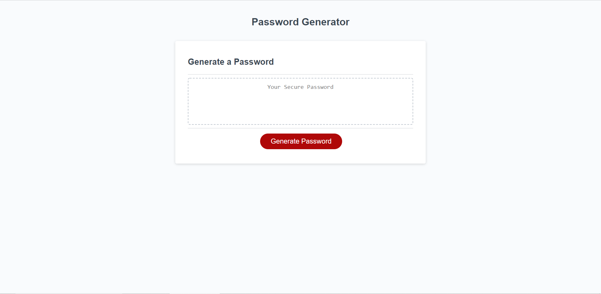

# random-password-generator

## Project Description
In this project we were tasked with building a random password generator. The password generator is supposed to generate a random password that meets certain criteria that is specified by the user. The password is supposed to prompt the user to see if they would like to include certain character types as well as ask how many characters they would like it to be. This was achieved through alerts, confirms, and prompts to make things function the way they should. The pasword needed to be between 8 and 128 characters long. By using an if statement and an alert we were able to limit the character amount to only be what was requested. The types of characters that could go into the prompt needed to be lowercase letters, uppercase letters, special characters, and numbers. The user is able to choose which of these they would like in their password and when they do their selection is then added into the character pool and that type of character is added to the password. The password is then generated and witten on the page. I also went through and made sure empty strings would be printed out so that there wasn't a scenario in which undefined was an option that was printed out as the password.

## Project Link
The project can be found [here](https://choyle-01.github.io/random-password-generator/)

GitHub Repository can be found [here](https://github.com/choyle-01/random-password-generator)

## Visuals
